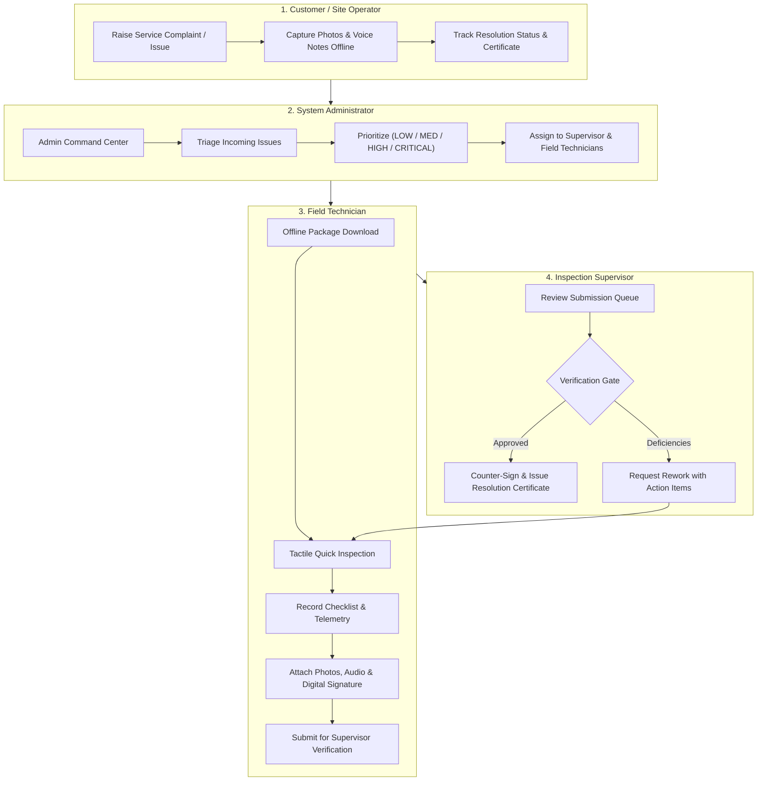
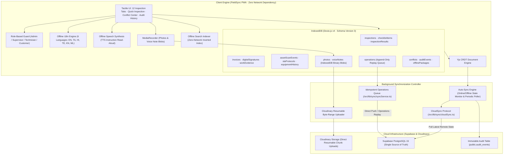

# FieldSync — Offline-First Collaborative Field Inspection PWA & TWA

[](https://www.typescriptlang.org/)
[](https://vitejs.dev/)
[](https://react.dev/)
[](https://dexie.org/)
[](https://yjs.dev/)
[](https://supabase.com/)
[](https://cloudinary.com/)
[](https://developer.chrome.com/docs/android/trusted-web-activity/)
[-green.svg)](https://vitest.dev/)

> **FieldSync** is an enterprise-grade, offline-first Progressive Web Application (PWA) and Trusted Web Activity (TWA) engineered for mission-critical industrial, utility, and infrastructure inspections in environments with intermittent or zero cellular connectivity. It integrates a **4-role enterprise lifecycle (Customer → Admin → Supervisor → Technician)**, real-time bi-directional Supabase PostgreSQL synchronization, Cloudinary byte-range resumable media uploads, Yjs CRDT conflict convergence, cryptographic dual signatures, and immutable append-only audit histories.

---

## 🌐 Live Deployments & Repository

- **Vercel Production App**: **[https://fieldsyncerode.vercel.app](https://fieldsyncerode.vercel.app)** *(Full PWA offline caching, Service Worker, and responsive UI)*
- **Cloudflare Edge Tunnel**: **[https://wife-assuming-seem-questionnaire.trycloudflare.com](https://wife-assuming-seem-questionnaire.trycloudflare.com)** *(Instant public edge access with zero configuration)*
- **GitHub Repository**: **[https://github.com/mailanupuda/fieldsync](https://github.com/mailanupuda/fieldsync)**

---

## 🎯 Problem Statement (WA-1) & Enterprise Scope

**WA-1. Offline-First Collaborative Field Inspection App**
- **Problem**: Industrial technicians inspect critical high-voltage substations, manufacturing machinery, underground conduits, and offshore facilities where wireless cellular signals are physically blocked.
- **Core Requirement**: A PWA that functions 100% offline, converges concurrent multi-user edits using CRDTs without silent overwrites, exposes transparent conflict adjudication and immutable audit logs, and handles resilient schema migrations and chunked media uploads.
- **Enterprise Scope**: FieldSync models a closed-loop operational lifecycle: self-service customer issue reporting $\rightarrow$ admin command triage & priority dispatch $\rightarrow$ technician tactile diagnostics & telemetry capture $\rightarrow$ supervisor verification gate, digital sign-off, and resolution certification.

---

## 👥 4-Role Enterprise Workflow

FieldSync organizes field operations into four specialized, authenticated roles with distinct capabilities:



### Preconfigured Demonstration Credentials (Password: `123456`)
| Role | Name | Email | Primary Responsibilities |
|---|---|---|---|
| **ADMIN** | Tharun | `tharun@gmail.com` | System configuration, role assignment, ticket triage, audit inspection |
| **SUPERVISOR** | Abi Kumar | `abi@gmail.com` | Quality assurance, verification queue sign-off, rework assignment, dual signatures |
| **TECHNICIAN** | Elakkiya S | `elakkiya@gmail.com` | Offline field inspection, tactile checklists, measurements, evidence capture |
| **TECHNICIAN** | Rajesh M | `rajesh@fieldsync.io` | Secondary field technician for concurrent multi-user CRDT conflict testing |
| **CUSTOMER** | Bob Abd | `customer@company.com` | Self-service complaint portal, tracking tickets, reviewing signed certificates |

---

## 🛠️ Complete 12 Inspection Workspaces & Subsystems

The inspection detail interface provides a comprehensive suite of 12 integrated functional modules:

1. **Overview**: Real-time inspection status, priority badges, assigned personnel, facility details, schedule milestones, and dynamic progress bar.
2. **Checklist**: Interactive inspection items with binary/ternary decision pills (`PASS`/`FAIL`, `GOOD`/`DAMAGED`), numeric bounds validation, audio note recording, photo attachments, and Text-to-Speech (TTS) read-aloud.
3. **Measurements**: Telemetry entries (temperature, pressure, voltage, vibration, resistance) with unit indicators, dynamic min/max threshold checks, timestamped histories, and trend analysis.
4. **Before / After**: Comparative visual evidence matching baseline pre-inspection photographs with post-repair photographs, featuring interactive split-view comparison and tamper-evident metadata.
5. **Signatures**: Dual cryptographic digital signatures (Technician and Customer / Supervisor) with role validation, timestamping, Base64 stroke encoding, and cloud/local persistence.
6. **Billing & Invoice**: Automated labor and parts line-item calculations, tax and discount computations, dynamic currency formatting, PDF export, and full invoice lifecycle tracking (`Draft` $\rightarrow$ `Issued` $\rightarrow$ `Paid`).
7. **Equipment History**: Complete asset lifecycle telemetry, historical maintenance records, previous inspection logs, component replacements, and failure frequency metrics.
8. **SLA Protocol**: Real-time SLA breach countdowns, response vs. resolution time tiers, severity matrix (`CRITICAL`, `HIGH`, `MEDIUM`, `LOW`), and automated escalation protocols.
9. **Notes**: Collaborative markdown notes with author attribution, timestamps, and real-time synchronization.
10. **Voice Notes**: On-device HTML5 `MediaRecorder` audio capture stored as binary Blobs in IndexedDB, with interactive Web Audio waveform playback and transcription.
11. **Photos & Work Evidence**: Byte-range chunked photo gallery with EXIF metadata, GPS geotagging, checklist item linkage, and direct Cloudinary CDN integration.
12. **Audit Log**: Immutable append-only audit trail logging all lifecycle events, status changes, user attribution, entity IDs, and before/after diffs from real PostgreSQL records.

---

## 🏛️ System Architecture



---

## 💡 How FieldSync Solves the Core Offline-First Challenges

### 1. Robust Bi-Directional Cloud Synchronization
- **Online Execution**: Mutations are pushed immediately to Supabase PostgreSQL across all enterprise tables (`inspections`, `checklist_items`, `inspection_results`, `notes`, `audit_events`, `invoices`, `digital_signatures`, `work_evidence`, `asset_scan_events`, `sla_protocols`).
- **Offline Resilience**: When disconnected, changes write instantly to IndexedDB with optimistic UI updates and enqueue in `db.operations`.
- **Automatic Reconnection Replay**: Upon network restoration, `syncService.ts` replays pending operations idempotently against Supabase using monotonic logical clocks, guaranteeing zero data duplication.
- **Dynamic Table Recovery**: `cloudSync.ts` uses self-refreshing cache invalidation so newly created cloud tables are ingested immediately without requiring hard browser reloads.

### 2. Client-Side Non-Destructive Schema Evolution
- **Sequential Migration Pipeline**: Implemented in [`src/lib/db/schema.ts`](file:///c:/Users/tharu/Downloads/erodde/src/lib/db/schema.ts) via Dexie.js v4.
  - `Version 1`: Core relational tables (`users`, `devices`, `inspections`, `assets`, `checklistItems`, `inspectionResults`, `notes`, `media`, `operations`, `conflicts`, `auditEvents`, `syncState`, `appMetadata`).
  - `Version 2`: Adds priority grading, scheduled dates, checklist bounds/units, and retry counters with safe backfills.
  - `Version 3`: Adds `voiceNotes` audio Blobs, `inspectionProgress` state bookmarking, `offlinePackages`, and composite index `[inspectionId+checklistItemId]`.
- **Stale Client Safety**: Devices offline for extended periods execute intermediate migration transactions ($v_1 \rightarrow v_2 \rightarrow v_3$) sequentially on boot without resetting uncommitted evidence or local caches.

### 3. Resumable Chunked Media Ingestion
- **Byte-Range Pipeline ([`src/lib/media/resumableUpload.ts`](file:///c:/Users/tharu/Downloads/erodde/src/lib/media/resumableUpload.ts))**: Large photographs ($2\text{--}8$\,MB) are partitioned into 1\,MB chunks uploaded directly to Cloudinary using signed authentication.
- **Offset Persistence**: Confirmed byte positions are stored locally in IndexedDB after each chunk. If network drops mid-upload, transfers resume from the exact byte offset rather than restarting from zero.
- **Two-Tier Prioritization**: Lightweight telemetry and audio notes are synchronized ahead of heavy image payloads.

### 4. Transparent Conflict Resolution & Immutable Audit History
- **Conflict Center ([`src/pages/ConflictCenter.tsx`](file:///c:/Users/tharu/Downloads/erodde/src/pages/ConflictCenter.tsx))**: Detects multi-technician concurrent modifications on shared assets. Displays side-by-side visual diffs (*Local Value* vs. *Server Value*, conflicting technician, timestamp) with explicit adjudication options (`KEEP_MINE`, `KEEP_THEIR`, or manual merge).
- **Recent Activity & Audit Trail ([`src/pages/AuditHistory.tsx`](file:///c:/Users/tharu/Downloads/erodde/src/pages/AuditHistory.tsx))**: Append-only audit logging directly in PostgreSQL and IndexedDB. Displays exact user attribution, before/after values, entity IDs, and relative timestamps with zero synthetic mock data.

---

## 📱 Google Play Store Packaging (PWA & Android TWA)

FieldSync is fully configured for publication to the **Google Play Store** as an Android application via **Trusted Web Activity (TWA)** and Google Chrome's [Bubblewrap](https://github.com/GoogleChromeLabs/bubblewrap) tooling:

- **TWA Manifest**: Configured in [`twa-manifest.json`](file:///c:/Users/tharu/Downloads/erodde/twa-manifest.json) targeting Android SDK 34 (Android 14) with minimum SDK 24 (Android 7.0).
- **Web App Manifest**: Standalone display mode, high-res maskable adaptive icons ($192\times 192$, $512\times 512$), enterprise theme color `#1e40af`, and quick action shortcuts.
- **Service Worker Precaching**: Full offline asset precaching via `vite-plugin-pwa` and Workbox, supporting zero-network boot and background sync.

```bash
# Build Android APK / App Bundle (AAB) using Bubblewrap
npx @bubblewrap/cli init --manifest=https://fieldsyncerode.vercel.app/manifest.webmanifest
npx @bubblewrap/cli build
```

---

## 🧪 Automated Testing & Verification

FieldSync maintains 21 automated unit and integration tests across 4 test suites:

```bash
# Run automated test suites
npx vitest run

# Run TypeScript typecheck
npx tsc --noEmit

# Compile production bundle
npm run build
```

### Verified Test Suites (`src/tests/`):
- **Customer Workflow Suite (`customerWorkflow.test.ts`)**: Validates end-to-end complaint logging, offline persistence, supervisor dispatch, and resolution verification.
- **Local Database Suite (`localDatabase.test.ts`)**: 9 tests verifying schema migrations, composite indexing, and CRUD operations on binary Blobs.
- **Offline Productivity Suite (`offlineProductivity.test.ts`)**: 8 tests confirming priority queue sorting, multilingual dictionary lookups, and local search queries.
- **Sync & Migration Suite (`syncAndMigration.test.ts`)**: 3 tests validating schema upgrades, pending operations serialization, and idempotent replay.

---

## 🚀 Local Development Setup

```bash
# Clone the repository
git clone https://github.com/mailanupuda/fieldsync.git
cd FieldSync

# Install dependencies
npm install

# Start local development server
npm run dev
```

Navigate to `http://localhost:5173` to test locally, or use the live production link: [https://fieldsyncerode.vercel.app](https://fieldsyncerode.vercel.app).
